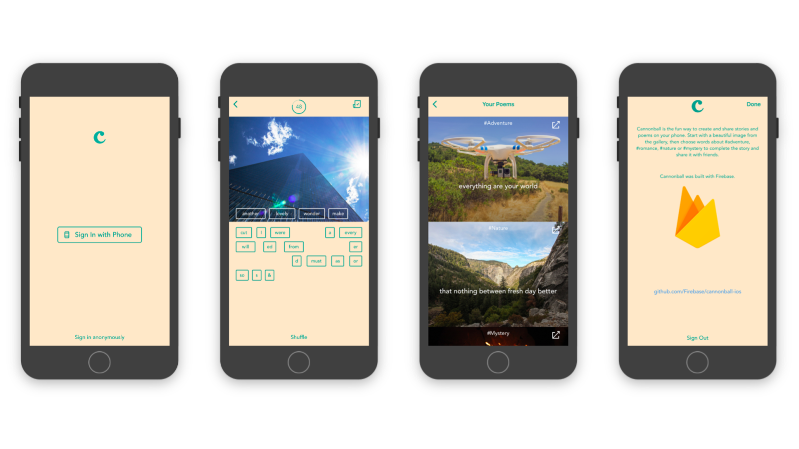

# Cannonball for iOS

This repository contains the source code for Cannonball, an iOS application written in Swift built with Fabric.

Cannonball is the fun way to create and share stories and poems on your phone. Start with a beautiful image from the gallery, then choose words about #adventure, #romance, #nature or #mystery to complete the story and share it with friends. Browse top stories created by other users for inspiration.

If you would like to play with the app, [Cannonball is available on the App Store](https://itunes.apple.com/us/app/cannonball-magnetic-poetry/id929750075).

## Fabric

Cannonball is a canonical sample iOS app to demonstrate how to use [Fabric](https://dev.twitter.com/fabric/overview), the easiest way to build the best apps.

Cannonball uses many of the features available in Fabric, including Crashlytics, Sign In with Twitter and Phone Number via Digits, the Twitter API Client, Embedded Tweets, the Tweet Composer to share on Twitter, as well as Native Ads from MoPub.

## Getting Started	

To get started and run the app following, you need to follow these simple steps:

1. Open the Cannonball project with Xcode.
2. Sign up for Fabric on [fabric.io](https://fabric.io).
3. Download and install the Fabric Mac app.
4. Install Crashlytics, Twitter and MoPub Kits from the Mac app. For Twitter, select Digits to complete the onboarding.
5. You're all set! Run Cannonball on your iPhone or the iOS Simulator.

## Compatibility

This project is written in Swift and requires Xcode 6.1.
Cannonball for iOS is compatible with iOS 7+.

## Contributors

* [Romain Huet](https://twitter.com/romainhuet)
* [Gareth Jones](https://twitter.com/gpj)
* [Ramón Argüello](https://twitter.com/monchote)
* [Javier Soto](https://twitter.com/Javi)
* [Chris Aniszczyk](https://twitter.com/cra)
* [Kang Chen](https://twitter.com/kang)

## License

Copyright 2014 Twitter, Inc. and contributors.

Licensed under the Apache License, Version 2.0: http://www.apache.org/licenses/LICENSE-2.0
